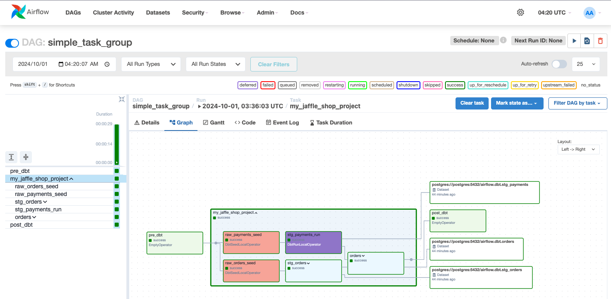

# astronomer-cosmos-poc

## Prerequisites
1. git
2. Python 3.9 or higher
3. Docker Desktop or Docker Compose

## Environment Setup
1. Clone this repository
```shell
git clone  https://github.com/snhou/astronomer-cosmos-poc.git
```
2. Build Docker Image

```shell
docker compose build
```
> if you modify your Dockerfile, you should add `--no-cache` argument to ignore previos cache

3. Create Docker Container

```shell
docker compose up -d
```

## Check dbt run properly
1. enter into docker container

```shell
docker exec -it astronomer-cosmos-poc-airflow-webserver-1 bash
```

2. Change into the `dbt/jaffle_shop` directory

```shell
cd /opt/airflow/dbt/jaffle_shop/
```

3. As usual, run all dbt steps
```shell
dbt debug
```

```shell
dbt seed
```

```shell
dbt run
```

```shell
dbt test
```

```shell
dbt clean
```


## Run Airflow DAG
